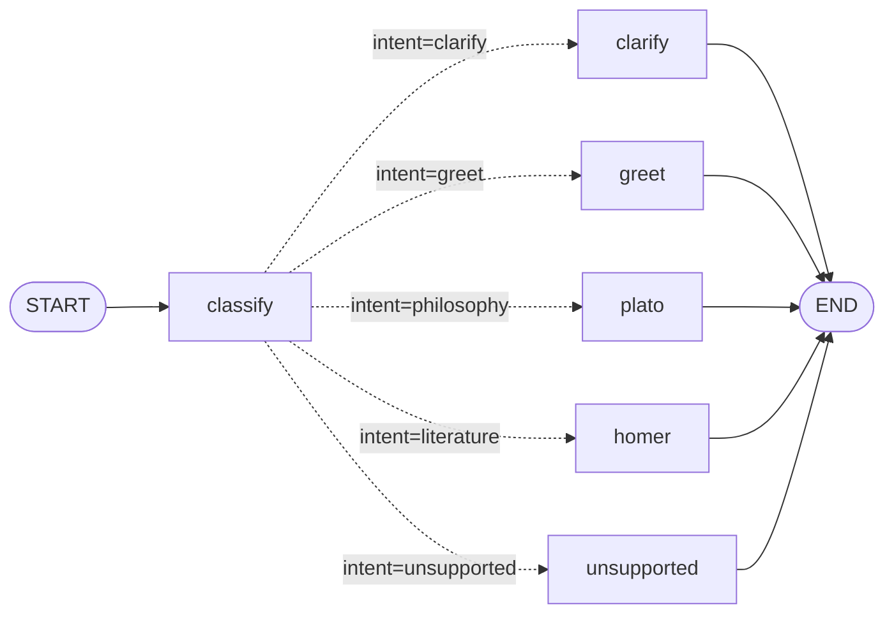
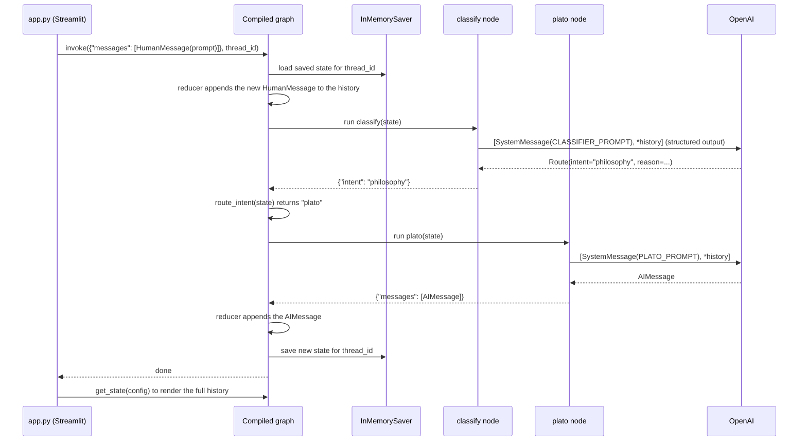

# Agent Orchestrator

A study project for LangGraph: a chat app with a Streamlit UI and an OpenAI model.

Version 2 adds conditional routing: a classifier node picks one of five answer nodes for each turn.

```
START -> classify -> clarify | greet | plato | homer | unsupported -> END
```

An `InMemorySaver` checkpointer keeps the conversation history for each `thread_id`. History is kept in memory only, so it is lost when the server stops.

## Graph workflow

The graph is built in `orchestrator/graph.py` by `build_graph()`:



- **State**: `State(MessagesState)`, the `messages` list plus an `intent` field. The `messages` reducer appends, so a node returns only the new messages. `intent` has no reducer, so each turn's classification overwrites the previous one. It is saved in the checkpoint, so `graph.get_state(config).values["intent"]` shows the last route taken.
- **Nodes**:
  - `classify` calls the model with `with_structured_output(Route)`, a Pydantic model with an `intent` and a short `reason`. It reads the whole history, so a follow-up like "tell me more" keeps the previous topic. It writes only `{"intent": ...}` and adds no message.
  - `clarify`, `greet`, `plato` and `homer` call the model with their own system prompt: ask a clarifying question, greet back, answer as Plato, answer as Homer.
  - `unsupported` returns a fixed `AIMessage` without calling the model.
- **Edges**: `START -> classify`, then a conditional edge: `route_intent(state)` maps `intent` to a node name (`philosophy -> plato`, `literature -> homer`, the others to the node with the same name). `add_conditional_edges` gets the list of targets so the drawn graph shows every branch. Each answer node goes to `END`.
- **Checkpointer**: `InMemorySaver`, passed to `builder.compile()`. It saves the state after each step, keyed by `thread_id`.

What happens in one chat turn (here, a philosophy question):



1. `app.py` calls `graph.invoke()` with only the new user message and the `thread_id` in the config.
2. LangGraph loads the saved state for that `thread_id` from the checkpointer, and the `MessagesState` reducer appends the new message.
3. `START` routes to `classify`, which writes `intent`.
4. The conditional edge calls `route_intent(state)` and runs the chosen answer node.
5. The answer node prepends its system prompt to the history and calls the model (or, for `unsupported`, builds a fixed reply). System prompts are sent on every call but never stored in state.
6. The node returns `{"messages": [response]}`. The reducer appends the reply.
7. The answer node's edge to `END` ends the run, and the checkpointer saves the updated state.
8. The UI reads the full history back with `graph.get_state(config)`.

## Setup

```bash
python3 -m venv .venv && source .venv/bin/activate
pip install -r requirements.txt
cp .env.example .env   # then set OPENAI_API_KEY
```

## Run

```bash
streamlit run app.py   # opens http://localhost:8501
```

## Logging

Logs are printed in the terminal running `streamlit run`. Set the level in `.env`:

```bash
LOG_LEVEL=INFO   # DEBUG, INFO, WARNING, ERROR (default INFO)
```

- `INFO`: each graph run, each node step, the user message, the classified intent and its reason, the assistant reply, LLM timing and token usage.
- `DEBUG`: also the state passed to each node, the message count sent to the LLM, and the compiled graph's nodes and edges.

Graph steps are logged by `GraphLoggingHandler` (in `orchestrator/tracing.py`), a LangChain callback handler. It reads the metadata LangGraph adds to each node run (`langgraph_step`, `langgraph_node`, `langgraph_triggers`), so new nodes are logged automatically. Third-party libraries (httpx, openai) only log warnings and errors.

Example of one chat turn at `INFO`:

```
17:41:21 INFO     app: prompt received (16 chars) thread=3f2a…
17:41:21 INFO     orchestrator.tracing: graph run started thread=3f2a… input_messages=1
17:41:21 INFO     orchestrator.tracing: step 1 -> node 'classify' started (triggers=branch:to:classify)
17:41:21 INFO     orchestrator.graph: user message: what is justice?
17:41:23 INFO     orchestrator.graph: intent=philosophy reason: The user is asking a fundamental philosophical question about the nature of justice.
17:41:23 INFO     orchestrator.tracing: node 'classify' finished in 1.04s, wrote: intent
17:41:23 INFO     orchestrator.tracing: step 2 -> node 'plato' started (triggers=branch:to:plato)
17:41:27 INFO     orchestrator.graph: assistant reply: Ah, my inquisitive interlocutor! You pose a question that has occupied the minds of many: What is justice? …
17:41:27 INFO     orchestrator.graph: LLM responded in 4.22s tokens in=49 out=355 total=404
17:41:27 INFO     orchestrator.tracing: node 'plato' finished in 4.22s, wrote: messages(+1)
17:41:27 INFO     orchestrator.tracing: graph run finished in 5.26s
```

## Layout

- `orchestrator/graph.py`: the LangGraph workflow
- `orchestrator/config.py`: loads settings from `.env`
- `orchestrator/logging_config.py`: sets up logging from `LOG_LEVEL`
- `orchestrator/tracing.py`: callback handler that logs graph runs and node steps
- `app.py`: the Streamlit chat UI
